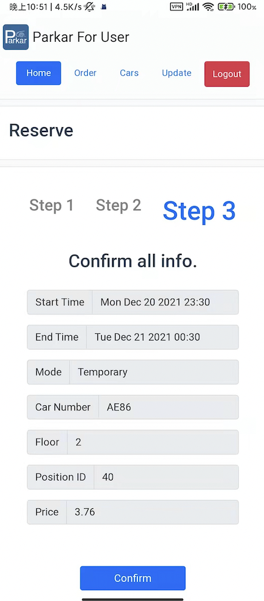
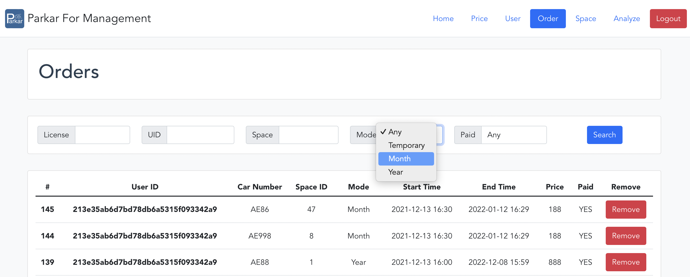
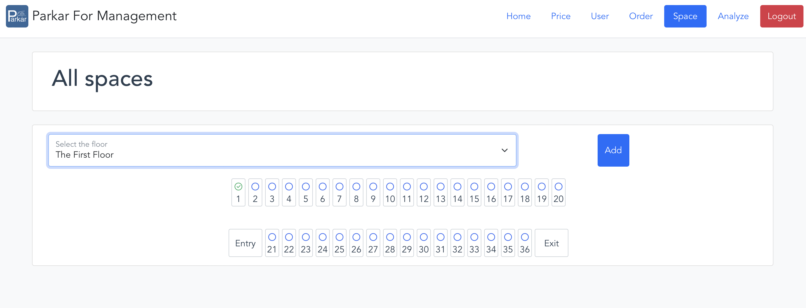
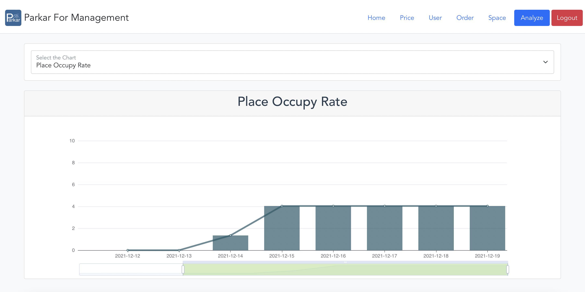

# Parkar

> 2019软件工程课程项目-停车场管理
>
> 项目成员：
>
> * [@NicerWang](https://github.com/NicerWang)
>* [@Tumbledore](https://github.com/TumbledoreAlalalala)
> * [@QingFeng](https://github.com/lihangyu1913092)
> * [@吕尤](https://github.com/lvyou2000)

项目共有6个模块，以下分别介绍。

## Adapter

> 基于`Spring Boot`，前端页面由`Thymeleaf`承载。

硬件适配器模块。

设计了一套通用的硬件接口(摄像头、传感器、电梯、操作面板)，并使用虚拟硬件对其进行了实现。

硬件可以与后台进行交互。

## Service-Admin

> 基于`Spring Boot`+`MyBatis`，使用`Restful API`，默认启用`swagger`

管理员服务模块。

* 面向管理员的功能：

  * 管理员登陆与密码修改

  * 定时`MapReuce`数据分析

* 面向用户的功能：

  * 数据收集

## Service-Management

> 基于`Spring Boot`+`MyBatis`，使用`Restful API`，默认启用`swagger`

车位管理系统。

* 面向用户的功能：

  * 价格查询

  * 查询(可用)车位

  * 提交订单、查询订单、延长订单、取消订单

  * 车位推荐

* 面向管理员的功能：
  * 查询所有订单、筛选订单、删除订单
  * 查询所有车位信息、增删车位、更新车位信息
  * 查询和设置价格

## Service-User

> 基于`Spring Boot`+`MyBatis Plus`，使用`Restful API`，默认启用`swagger`

用户管理系统。

* 面向用户的功能
  * 登陆注册
  * 更新信息
  * 增删车牌号
* 面向管理员的功能
  * 查询所有用户、删除用户

## Frontend-User

> 基于`vue3`+`vuex`+`vue-router`

用户前端。

* 通过响应式布局和`PWA`，支持了移动端。

  

* 可视化车位选择。

* 页面渐变过渡、加载动画、权限管理。

## Frontend-Management

> 基于`vue3`+`vuex`+`vue-router`

管理员前端。

* 页面渐变过渡、加载动画、权限管理。

* 模糊查询

  

* 可视化车位选择

  

* 基于`Echart`的数据展示

  

## 关于部署

* `devops`工作流

  在`push`时，添加对应`tag`即可触发一次部署。

  | `Tag`（`x.x.x`为版本号） | 部署模块            |
  | ------------------------ | ------------------- |
  | `vfux.x.x`               | frontend-user       |
  | `vfmx.x.x`               | frontend-management |
  | `vax.x.x`                | adapter             |
  | `vsux.x.x`               | service-user        |
  | `vsmx.x.x`               | service-management  |
  | `vsax.x.x`               | service-admin       |

* 部署为分布式的，即不同的模块会部署到不同机器上。

* 对于`service`

  * 部署的`docker-compose`文件在`database`目录下，其中还有对应数据库的`sql`文件及`mysql`的配置文件。

* 对于`frontend`

  * `nginx`配置文件在其中
  * 所有的请求都是由一台机器处理的(`frontend-user`)，需要正确配置其他机器的`API`地址，其他处不需要额外配置。

* 对于`adapter`

  * 部署时，必须修改其中的API地址。

* 关于`swagger`

  为便于开发，数据库端口开放，同时`swagger`打开，使用时可以关闭。

* 关于开发

  * **请在提交代码时将spring.profiles.active改为production**
    
    * 如非必要，不要改动`production`配置文件
    
  * 数据库内容请写在`database/模块名/base.sql`当中
    * 注意建表的顺序，如果有外键，则需要把被依赖的表先建立
    * 建议使用`alter`改动表，并在`base.sql`更新相应操作，因为重新部署时不会重新执行`sql`，需要手动删除数据
    * 所有的`3306`端口均已打开，用户名密码和`application.yml`中一致
    
  * `JWTUtil`已全部配置完成，可以直接使用：

    ```java
    JWTUtil.Sign(userID)//传入用户ID，得到对应的Token
    JWTUtil.check(token)//传入token，返回用户名，如果无效，返回空
    JWTUtil.checkAdmin(token)//传入token，判断是否为admin，返回布尔值
    ```
